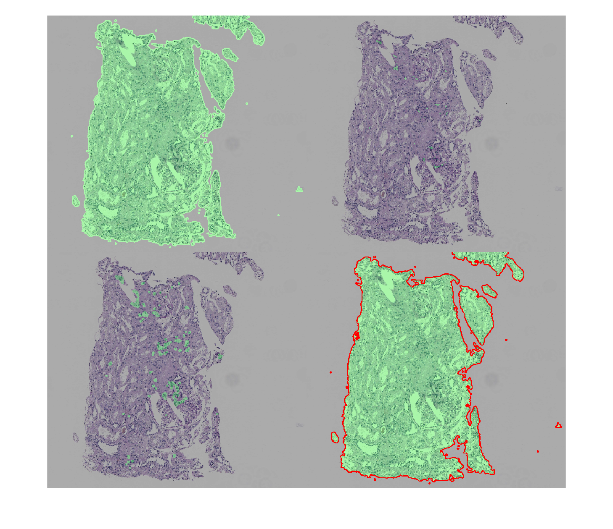

# Deep Learning workflow for computational pathology
This repository shows an example of how to use MATLAB to manipulate very large images in the context of computational pathology (CPATH). 

It is structured in two parts: 
1. How to handle very large images such as whole slide images (WSIs)
2. How to pre- and post-process histology images. 

## Part 1: Handling gigapixel-sized WSIs
The first part of this example shows how to read, display, explore, and organize WSIs (and their patches) in MATLAB. Thanks to the recently introduced `blockedImage` object, it is now possible to handle very large images without running out of memory. A `blockedImage`  is an image made from discrete blocks (patches), which can be organized and managed using a `blockedImageDatastore` object and displayed using `bigimageshow`.

## Part 2: Useful pre- and post-processing operations on WSIs in MATLAB

Since the goal of using deep learning techniques in CPATH is to produce solutions that are clinically translatable, i.e., capable of working across large patient populations, it is advisable to deal with some of the most likely WSI artifacts upfront, thereby increasing the abilities of the resulting model to generalize over image artifacts found in other test sets. 

The second part of this example shows examples of preprocessing operations to handle commonly found artifacts in histopathology images as well as postprocessing morphological operations for improving the quality of the results at pixel level. Essentially, this example should help the medical image analysis community to create an image analysis pipeline for WSIs (and, as bonus, the ability to reproduce the code and examples described in a [recent paper](https://www.ncbi.nlm.nih.gov/pmc/articles/PMC8057393/) on this topic) using MATLAB.

It highlights the usefulness of MATLAB (and Image Processing Toolbox) functions such as: 
- Image thresholding and filtering: `imbinarize`,`bwareafilt`, and `imlincomb`
- Morphological image processing operations: `imclose`, `imopen`, `imdilate`, `imerode`, `imfill`, and `strel`
- Feature extraction: `bwlabel` and `regionprops`
- Visualization: `montage`, `imoverlay`, `plot` and `rectangle`

|  |

## Requirements
- [X]  [MATLAB 2021a](https://www.mathworks.com/products/matlab.html) or later
- [X]  [Image Processing Toolbox](https://www.mathworks.com/products/image.html)

## Suggested steps
1. Download or clone the repository.
2. Open MATLAB.
3. Ensure that the files `AT2Scan.jpg` and `FakePred2.jpg` containing the test images[1](#myfootnote1) for Part 2 are in the same folder as the `cpath_matlab.mlx` file. 
4. Run the `cpath_matlab.mlx` script and inspect results.
## Additional remarks

- You are encouraged to expand and adapt the example to your needs.
- The image used for Part 1 is part of MATLAB.
## Notes
<a name="myfootnote1">[1]</a> These images are publicly available at (https://github.com/BHSmith3/Image-Cleaning). 
